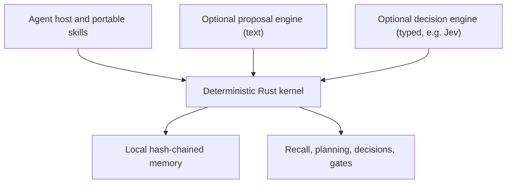

# Hikmah Stack

**A deterministic Rust memory and reliability kernel for AI agents.**

[](https://github.com/CodeWithJuber/hikmah-stack/actions/workflows/validate.yml)
[](LICENSE)

Hikmah Stack is an open-source reference implementation for keeping selected agent responsibilities outside a generative model's hidden state. Its Rust kernel provides local, inspectable mechanisms for provenance-bearing memory, contradiction detection, bounded recall, commitments, symbolic planning, decision controls, and narrow completion checks.

> **Portfolio summary:** This repository demonstrates systems design and hands-on Rust implementation for deterministic Agentic AI memory and reliability controls. It is a working local proof of concept, not an end-to-end enterprise GenAI platform.

Maintained by [Juber Shaikh](https://github.com/CodeWithJuber) · MIT licensed

## Recruiter-verifiable evidence

The table below separates executable evidence from architectural intent.

| Demonstrated capability | Inspectable proof | Evidence level |
|---|---|---|
| Typed agent memory with provenance, confidence, privacy, deadlines, claims, and correction links | [`Trace`, `Provenance`, and validation](runtime/hikmah-kernel/src/trace.rs) | Implemented; model-authored traces can never be marked verified. `source` and `verified` are the caller's claims, not authenticated; a write from a detected AI agent session is stamped `agent-session:<host>:<id>` and cannot be marked verified |
| Append-only, sequence-numbered, hash-chained local ledger | [`MemoryStore`](runtime/hikmah-kernel/src/ledger.rs) and [ledger tests](runtime/hikmah-kernel/tests/ledger.rs) | Implemented and tested: validate-before-write, exclusive file lock, concurrent writers, torn-tail repair, head file for truncation and unacknowledged appends, pinned-head check, legacy v1 ledgers |
| Contradiction-aware structured claims | [Conflict detection](runtime/hikmah-kernel/src/claims.rs) and tests ([consolidation](runtime/hikmah-kernel/tests/consolidation.rs), [conflicts](runtime/hikmah-kernel/tests/conflicts.rs)) | Implemented and tested (Unicode NFC, case-sensitive values, supersession); recall lists open conflicts and supersession links beside each result, and `hikmah conflicts` lists every open conflict. Detection only: the kernel never picks a winner |
| Relevance-gated contextual recall with metadata scaling and duplicate folding | [Recall](runtime/hikmah-kernel/src/recall.rs) and [recall tests](runtime/hikmah-kernel/tests/recall.rs) | Implemented and tested; lexical, not semantic |
| Evidence-preserving consolidation proposals | [`consolidation_proposals`](runtime/hikmah-kernel/src/consolidation.rs) | Implemented and tested; no automatic promotion; model output never counts as support |
| Prospective commitments with deadlines and fulfilment | [`commitments_due`](runtime/hikmah-kernel/src/prospective.rs), CLI `--deadline` and `fulfill` | Implemented and tested |
| Bounded symbolic planning | [Planner](runtime/hikmah-kernel/src/planner.rs) and [tests](runtime/hikmah-kernel/tests/planner.rs) | Implemented and tested (depth and state budgets) |
| Decision ranking with hard blocks, unknown criteria as score intervals, and a reversibility preference | [Decision evaluator](runtime/hikmah-kernel/src/decision.rs) and [tests](runtime/hikmah-kernel/tests/decisions.rs) | Implemented and tested: an unscored criterion spans the whole scale, options rank by the interval's lower bound, and `decisive` says whether the unknowns could change the winner |
| Deterministic challenge lanes; risk and human-impact lanes veto on one item | [`deliberate`](runtime/hikmah-kernel/src/council.rs) | Implemented and tested; lanes read counts supplied by the caller; not LLM agents |
| Typed decision port (choice / score / noul) with all-or-nothing admission | [`decision_port`](runtime/hikmah-kernel/src/decision_port.rs), [tests](runtime/hikmah-kernel/tests/decision_port.rs), [design](docs/DECISION_PORT.md) | Implemented and tested |
| TypeSafe Jev adapter (opt-in, `jev` feature) | [`jev`](runtime/hikmah-kernel/src/jev.rs) and [tests](runtime/hikmah-kernel/tests/jev.rs) with a captured `jev-1.13.0` response | Implemented; offline tests plus an ignored live test |
| Outcome write-back and calibration (Brier, ECE) | [`calibration`](runtime/hikmah-kernel/src/calibration.rs), CLI `outcome` and `calibration` | Implemented and tested; a family is `measurable` at 50 outcomes and `calibrated` only if Spiegelhalter's Z test does not reject (alpha 0.05) and it beats the base-rate Brier |
| Narrow completion-claim hygiene | [Rust Truth Gate](runtime/hikmah-kernel/src/hook.rs), [launcher](hooks/truth_gate.sh), [Python fallback](hooks/truth_gate.py), [golden cases](hooks/truth_gate_cases.json) | Implemented. Rust and Python pass the same golden cases in CI. Deliberately not a fact-checker. The rules rarely fire on real agent "done" messages. The optional engine mode is a measured screen: it catches about one false completion in six ([numbers](docs/DECISION_PORT.md#truth-gate-engine-mode-measured-not-assumed)). With `HIKMAH_HOOK_RECORD` and `hikmah gate-threshold`, the threshold can be re-chosen from your own recorded outcomes ([how](docs/DECISION_PORT.md#choosing-the-threshold-from-your-own-traffic)). |
| Reusable host packaging | [Codex manifest](.codex-plugin/plugin.json), [Claude manifest](.claude-plugin/plugin.json), [Kimi manifest](kimi.plugin.json), and [portable skills](skills/) | Configuration and instruction layer; versions, names, and hook paths checked by `hikmah validate` |
| Automated validation | [GitHub Actions workflow](.github/workflows/validate.yml): fmt, Clippy (with and without network features), Rust tests, package validation, Python golden cases, hook launcher smoke test | CI-backed repository validation |

## Maturity boundary

| Area | Current state |
|---|---|
| Core runtime | Working Rust CLI and library reference implementation |
| Persistence | Local append-only JSONL, hash-chained over exact payload bytes, with an exclusive write lock, torn-tail repair, and a head file. The chain is not keyed. On its own it detects a record edited, reordered, or injected inside it. The head file adds truncation, rewrites, and records appended without a head update: those fail `verify-ledger` and block writes until a person accepts them (`verify-ledger --accept-tail` or `--reset-head`, both refused inside a detected AI agent session). Neither detects an append or re-chain by someone who can also update or delete the head file; only a head hash pinned outside the writer's reach (`--expect-head`) does |
| Retrieval | Deterministic relevance gate (terms or tags must match), light stemming, CJK bigrams, metadata scaling, duplicate folding; no embeddings |
| Model integration | Typed `DecisionEngine` port with `NoEngine` and an opt-in TypeSafe Jev adapter; the text `ProposalEngine` still ships only `NoModel` |
| Agent packaging | Portable instruction skills and thin Codex, Claude Code, and Kimi manifests |
| Tests | 136 unit and integration tests (plus 1 ignored live Jev test) covering every capability row; shared Truth Gate golden cases (messages and malformed payloads) for Rust and Python |
| Deployment | Local source/CLI use; no hosted service or public production deployment is claimed |

### What this repository does not claim

Hikmah Stack does **not** currently implement or claim:

- an LLM inference application or model-training pipeline;
- RAG, document ingestion, embeddings, reranking, or a vector database;
- an LLM multi-agent runtime or orchestration through LangGraph, LangChain, Semantic Kernel, AutoGen, CrewAI, or Copilot Studio;
- a custom LLM tool/function-calling runtime or autonomous execution against external systems;
- Azure OpenAI, Azure AI Foundry, AWS Bedrock, or a general cloud-model integration; the only remote model integration is the opt-in Jev adapter for typed decisions;
- a Python AI/GenAI application; the Python file is only a small compatibility fallback for the Truth Gate;
- an HTTP API, MCP server, enterprise application/database/RPA connector, or multi-tenant service;
- production-scale security, encryption, access control, observability, load testing, or deployment automation.

These are integration opportunities, not hidden capabilities. The current value is the deterministic kernel and the explicit control boundary it gives future model- and tool-driven systems.

## Architecture

Hikmah separates generative proposals from durable state and deterministic controls.



The kernel exposes two boundaries. The text [`ProposalEngine`](runtime/hikmah-kernel/src/model_port.rs) still ships only `NoModel`. The typed [`DecisionEngine`](runtime/hikmah-kernel/src/decision_port.rs) ships `NoEngine` and an opt-in adapter for TypeSafe's Jev, which answers bounded choice, score, and yes/no questions with probabilities. Either way, engine output is a proposal: the kernel checks every typed answer against the question asked, rejects the whole response on any violation, records answers only as unverified predictions, and earns calibration from outcomes.

See [Architecture](docs/ARCHITECTURE.md), [Cognitive Kernel](docs/COGNITIVE_KERNEL.md), [Co-Model Architecture](docs/CO_MODEL.md), and [Typed Decision Port](docs/DECISION_PORT.md).

## Capability stack

| Capability | Responsibility |
|---|---|
| **Operator Core** | Human judgment, leadership, ethics, communication, recovery, and stewardship |
| **Agent Radar** | Diagnose hallucination, loops, context loss, sycophancy, opacity, cost, and memory failures |
| **Decision Forge** | Structure options, evidence coverage, hard constraints, reversibility, and action |
| **Ship Guard** | Define acceptance criteria, verification, rollback, handoffs, and completion discipline |
| **Hikmah Orchestrator** | Route across the portable skills and synthesize one response |
| **Cognitive Kernel** | Maintain local typed memory, contradictions, commitments, and deterministic controls |
| **Truth Gate** | Catch a narrow class of contradictory completion claims at host stop time |

The first five capabilities are primarily portable instruction skills. The Cognitive Kernel and Rust Truth Gate contain the executable runtime behavior.

## TraceWeave memory

A memory is an immutable **trace** with a kind, content, provenance, confidence, salience, privacy class, creation time, optional deadline, optional structured claim, and optional correction link.

The local ledger is append-only and hash-chained. Corrections can supersede earlier traces without rewriting history, and conflicting structured claims remain visible rather than silently replacing one another.

At recall time, a trace must first match the query's cues (terms or tags). Unrelated memories are never returned, however confident or salient they claim to be. Relevance then sets the score, and metadata can only scale it:

- relevance: query-term coverage plus overlap (stopwords removed, light English stemming, character bigrams for CJK text), and tag coverage;
- metadata: recency, salience, confidence, provenance authority and verification, and commitment urgency.

Near-identical traces are folded into one result with a duplicate count. Overdue commitments surface without a cue. Model predictions are excluded unless asked for. This is a transparent deterministic baseline, not semantic embedding retrieval. Read [Memory](docs/MEMORY.md) and the [Remember → Recall → Consolidate playbook](playbooks/remember-recall-consolidate.md).

## Quick start

### Prerequisites

- Rust stable toolchain with Cargo
- Python 3 only if the zero-install compatibility hook is needed

### Build and verify

```bash
git clone https://github.com/CodeWithJuber/hikmah-stack.git
cd hikmah-stack

cargo fmt --check
cargo clippy --workspace --all-targets -- -D warnings
cargo test --workspace
cargo run -p hikmah-kernel -- validate --root .
```

### Create and query local memory

```bash
cargo run -p hikmah-kernel -- init

cargo run -p hikmah-kernel -- remember \
  --kind observation \
  --content "Migration failed because the lock timed out" \
  --source incident-review \
  --tag database \
  --tag deployment \
  --salience 0.9 \
  --confidence 0.9 \
  --verified

cargo run -p hikmah-kernel -- recall \
  --query "why did the deployment fail"

cargo run -p hikmah-kernel -- remember \
  --kind commitment \
  --content "Send the incident report to the platform team" \
  --source incident-review \
  --deadline +48h

cargo run -p hikmah-kernel -- consolidate
cargo run -p hikmah-kernel -- commitments --within-hours 168
cargo run -p hikmah-kernel -- fulfill --id <commitment-trace-id>
cargo run -p hikmah-kernel -- verify-ledger
```

`--source` defaults to `unknown`. Use `model:<engine>` for anything a model wrote; the kernel refuses to mark such traces verified or to let them supersede others. `--source` and `--verified` are claims made by whoever runs the command, and the kernel does not authenticate them.

Inside an AI agent session, `remember` and `outcome` record the locator `agent-session:<host>:<session id>` (a caller `--locator` is kept after it). `remember --verified`, `verify-ledger --accept-tail`, and `verify-ledger --reset-head` are refused, because each is a person's decision. The session is detected from host variables: `CLAUDECODE`, `CLAUDE_CODE_*`, `CODEX_*`, `CURSOR_*`, `GEMINI_CLI`, and `AI_AGENT`. Documented configuration settings such as `CODEX_HOME`, `CLAUDE_CODE_USE_BEDROCK`, and `CLAUDE_CODE_ENABLE_TELEMETRY` do not count. To verify a claim an agent recorded, a person runs `remember --verified --supersedes <id>` from their own terminal. This check stops an agent from verifying its own memory, or approving records appended behind the ledger's back, by default. It is not authentication: a process that clears those variables is not detected. If you are refused in your own shell, for example in an IDE's integrated terminal, see "Agent sessions" in [docs/MEMORY.md](docs/MEMORY.md).

`verify-ledger` exits non-zero when the chain, the head file, or a pinned `--expect-head` does not match, and when records follow the head file that no hikmah write acknowledged (it lists them under `unacknowledged`). While they disagree, writes are refused. Reads such as `recall` still include those records, so inspect them before relying on what they claim. After a person inspects appended records, `verify-ledger --accept-tail` acknowledges them; after a deliberate repair, `verify-ledger --reset-head` accepts the current ledger. Neither can be combined with `--expect-head`, which only a plain verification checks.

By default, local memory is written to `.hikmah/memory.jsonl`.

Limits, thresholds, and every recall weight are fields of the kernel policy. `hikmah policy --print-defaults` prints them. `hikmah --policy my-policy.json <command>` (or `HIKMAH_POLICY=my-policy.json`) overrides any subset. Missing fields keep their defaults, unknown fields and out-of-range values are errors, and the hook never reads the policy. The defaults are design choices, not calibrated values.

### Run planning and decision examples

```bash
cargo run -p hikmah-kernel -- plan \
  --problem examples/plan-problem.json

cargo run -p hikmah-kernel -- decide \
  --frame examples/decision-frame.json

cargo run -p hikmah-kernel -- deliberate \
  --unverified-claims 1 \
  --memory-conflicts 0 \
  --irreversible-actions 0 \
  --human-impact-questions 0 \
  --missing-acceptance-criteria 1
```

### Typed decisions (optional Jev engine)

```bash
# Offline: the default engine abstains, so callers must handle "unknown".
cargo run -p hikmah-kernel -- ask --request examples/decision-request.json

# With TypeSafe Jev: answers are admitted only if every one matches the question asked.
export TYPESAFE_API_KEY=...
cargo run -p hikmah-kernel -- ask --request examples/decision-request.json --engine jev --record
cargo run -p hikmah-kernel -- outcome --prediction <prediction-trace-id> --observed false --source oncall
cargo run -p hikmah-kernel -- calibration

# Let the engine estimate criteria an option has no evidence for (ranked, never counted as evidence).
cargo run -p hikmah-kernel -- decide --frame examples/decision-frame.json --engine jev
```

See [Typed Decision Port](docs/DECISION_PORT.md). Build without any network code with `cargo build --no-default-features`.

## Portable skills and host adapters

The files under [`skills/`](skills/) are the portable layer. Host adapters package or preload those instructions; they do not turn Hikmah into a model provider or multi-agent runtime.

The read-only Claude adapter declares a small set of host-provided repository tools. That configuration should not be confused with an implemented custom function-calling pipeline or enterprise action layer.

### ChatGPT and Codex

Register the repository as a marketplace source:

```bash
codex plugin marketplace add CodeWithJuber/hikmah-stack
```

This command adds the catalog source; install and test the plugin from the ChatGPT desktop app's Plugins Directory. The included Codex manifest references the portable skills and the command-based completion hook.

### Claude Code

```text
/plugin marketplace add CodeWithJuber/hikmah-stack
/plugin install hikmah-stack@hikmah-stack
```

If the install summary asks you to activate the plugin, run `/reload-plugins`. The repository also includes a read-only Claude orchestrator adapter and a deterministic-plus-prompt completion check.

### Kimi

The root [`kimi.plugin.json`](kimi.plugin.json) points to `./skills/` and supplies routing guidance through `skillInstructions`. Add the repository as a Kimi plugin, or package the repository for the relevant catalog flow.

### OpenClaw

OpenClaw can install this repository as a Codex-compatible bundle; no separate native plugin is required for the portable skills:

```bash
openclaw plugins install git:github.com/CodeWithJuber/hikmah-stack --accept-capabilities
openclaw plugins inspect hikmah-stack
openclaw gateway restart
```

The bundle exposes the six directories under `skills/` as normal OpenClaw skills. Verify them after restart with `openclaw skills list` or `openclaw skills check`.

This integration is skills-only at runtime. OpenClaw detects the Codex hook declaration, but `hooks/codex.json` is not an OpenClaw `HOOK.md` plus `handler.ts`/`handler.js` hook pack, so OpenClaw does not execute it. The Rust kernel also remains a separate local CLI/library; installing the bundle does not register kernel tools, an MCP server, or a model provider.

### Other skill-aware hosts

Reuse the required directories under `skills/`. Keep host-specific adapters thin and review executable hooks before enabling them.

See [Compatibility](docs/COMPATIBILITY.md).

## Playbooks

- [Remember → Recall → Consolidate](playbooks/remember-recall-consolidate.md)
- [Parallel Deliberation](playbooks/parallel-deliberation.md)
- [Error → Durable Learning](playbooks/error-to-learning.md)

## Lenses

- [Memory Integrity](lenses/memory-integrity.md)
- [Model Independence](lenses/model-independence.md)
- [Human Memory Inspiration](lenses/human-memory-inspiration.md)

## Human-inspired, empirically bounded

Hikmah borrows software design ideas from research on selective consolidation, replay, temporal structure, correction, bounded attention, and prospective memory. The project does not claim to reproduce a brain or prove a software mechanism from a biological analogy.

Research sources and limitations are maintained in [Research Notes](docs/RESEARCH.md). Proposed measurements are listed in the [Evaluation Contract](docs/EVALUATION.md); that document is a measurement specification, not evidence that all benchmarks have already been run.

## Design doctrine

1. Evidence before confidence.
2. Memory is typed, provenance-bearing state, not hidden chain-of-thought.
3. Corrections supersede; contradictions remain visible.
4. Models propose; explicit controls govern durable state transitions.
5. Human-impact, privacy, consent, and safety blocks are not averaged away by a high score.
6. Independent challenge surfaces failures more clearly than self-grading alone.
7. Observed outcomes are more useful than unverified plans.
8. Unknown is a valid serialized state.
9. New architecture should beat a measurable baseline before it is preferred for novelty.
10. Discovered failures should become tests, controls, or documented limitations.

## Repository map

```text
runtime/hikmah-kernel/      deterministic Rust library and CLI
runtime/hikmah-kernel/tests focused integration tests
skills/                     portable judgment and cognition instructions
agents/                     thin host-specific agent adapter
playbooks/                  operational cognitive loops
lenses/                     reusable diagnostic perspectives
docs/                       architecture, memory, research, ethics, and evaluation
examples/                   symbolic planning and decision-frame inputs
hooks/                      Rust-first completion hook plus Python fallback
.codex-plugin/              Codex plugin manifest
.claude-plugin/             Claude Code plugin metadata
kimi.plugin.json            Kimi plugin manifest
.github/workflows/          repository validation CI
```

## Security and privacy boundaries

Hikmah ships no credentials, privileged remote service, or external database connection.

- The reference store is local JSONL.
- Hash chaining provides tamper evidence within the limits in [Security](SECURITY.md) (the chain is unkeyed); it does not encrypt content or provide access control.
- `sensitive` persistence is refused by default.
- A trace whose text looks like a credential (common token, key, and password shapes; not a DLP system) is refused before it is written.
- The append-only reference ledger is not a complete right-to-delete implementation.
- A production system handling sensitive data needs an encrypted, access-controlled, deletion-capable storage adapter and an explicit retention policy.
- The narrow Truth Gate does not fact-check arbitrary model output.
- Network egress happens only when a decision engine is explicitly selected (`--engine jev` or `HIKMAH_HOOK_ENGINE=jev`) and `TYPESAFE_API_KEY` is set. State that looks like a credential is refused before any call.

Review [Security](SECURITY.md) before enabling executable hooks or adapting the memory layer for sensitive environments.

Hikmah is decision-support infrastructure. It is not a substitute for current qualified medical, legal, financial, security, religious, or other professional judgment.

## Project documentation

- [Architecture](docs/ARCHITECTURE.md)
- [Cognitive Kernel](docs/COGNITIVE_KERNEL.md)
- [Co-Model Architecture](docs/CO_MODEL.md)
- [Typed Decision Port](docs/DECISION_PORT.md)
- [Memory](docs/MEMORY.md)
- [Evaluation Contract](docs/EVALUATION.md)
- [Research Notes](docs/RESEARCH.md)
- [Ethics](docs/ETHICS.md)
- [Compatibility](docs/COMPATIBILITY.md)
- [Changelog](CHANGELOG.md)
- [Contributing](CONTRIBUTING.md)
- [Security](SECURITY.md)

## License

MIT. See [LICENSE](LICENSE).
