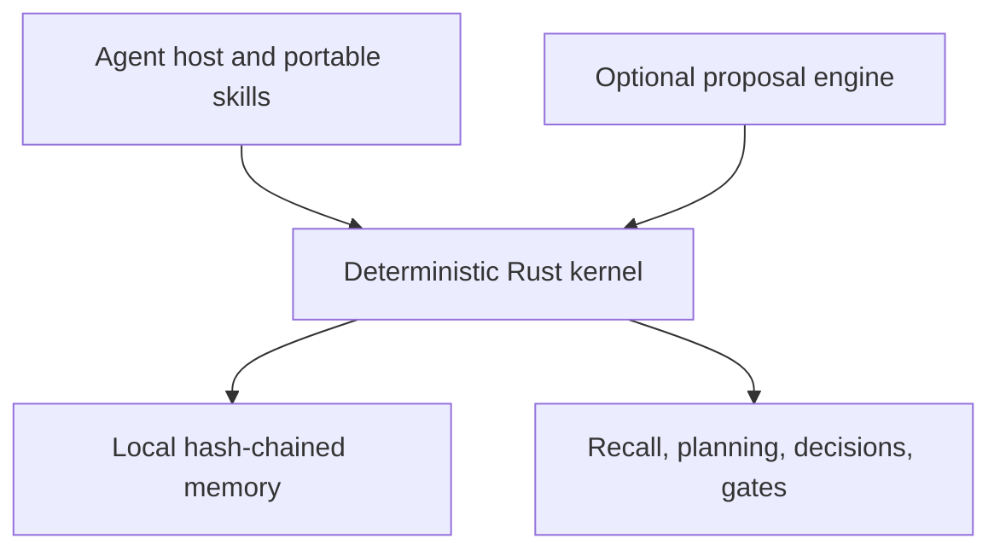

# Hikmah Stack

**A deterministic Rust memory and reliability kernel for AI agents.**

[](https://github.com/CodeWithJuber/hikmah-stack/actions/workflows/validate.yml)
[](LICENSE)

Hikmah Stack is an open-source reference implementation for keeping selected agent responsibilities outside a generative model's hidden state. Its Rust kernel provides local, inspectable mechanisms for provenance-bearing memory, contradiction detection, bounded recall, commitments, symbolic planning, decision controls, and narrow completion checks.

> **Portfolio summary:** This repository demonstrates systems design and hands-on Rust implementation for deterministic Agentic AI memory and reliability controls. It is a working local proof of concept, not an end-to-end enterprise GenAI platform.

Maintained by [Juber Shaikh](https://github.com/CodeWithJuber) · MIT licensed

## Recruiter-verifiable evidence

The table below separates executable evidence from architectural intent.

| Demonstrated capability | Inspectable proof | Evidence level |
|---|---|---|
| Typed agent memory with provenance, confidence, privacy, deadlines, claims, and correction links | [`Trace`, `Provenance`, and validation](runtime/hikmah-kernel/src/trace.rs#L92-L174) | Implemented |
| Append-only, sequence-numbered, hash-chained local ledger | [`MemoryStore::open`, integrity replay, append, and verify](runtime/hikmah-kernel/src/ledger.rs#L51-L228) | Implemented; persistence and replay are tested |
| Contradiction-aware structured claims | [Conflict detection](runtime/hikmah-kernel/src/claims.rs) and [integration test](runtime/hikmah-kernel/tests/traceweave.rs#L40-L56) | Implemented and tested |
| Contextual bounded recall using lexical, tag, recency, salience, confidence, provenance, and deadline signals | [Recall scoring and redundancy suppression](runtime/hikmah-kernel/src/recall.rs#L46-L151) and [persistence/recall test](runtime/hikmah-kernel/tests/traceweave.rs#L16-L38) | Implemented and tested |
| Evidence-preserving consolidation proposals | [`consolidation_proposals`](runtime/hikmah-kernel/src/consolidation.rs#L19-L84) | Implemented; no automatic promotion |
| Prospective commitment recall | [`commitments_due`](runtime/hikmah-kernel/src/prospective.rs#L13-L33) | Implemented |
| Bounded symbolic planning | [Planner](runtime/hikmah-kernel/src/planner.rs#L33-L101) and [integration test](runtime/hikmah-kernel/tests/planner.rs) | Implemented and tested |
| Evidence-adjusted decision ranking with hard blocks and reversibility | [Decision evaluator](runtime/hikmah-kernel/src/decision.rs#L48-L118) and [example frame](examples/decision-frame.json) | Implemented with a runnable example |
| Independent evidence, memory, risk, human-impact, and delivery checks | [`deliberate`](runtime/hikmah-kernel/src/council.rs#L36-L91) | Implemented as deterministic concurrent checks; not LLM agents |
| Narrow completion-claim hygiene | [Rust Truth Gate](runtime/hikmah-kernel/src/hook.rs#L6-L78), [shell launcher](hooks/truth_gate.sh), and [Python compatibility fallback](hooks/truth_gate.py) | Implemented; deliberately not a fact-checker |
| Reusable host packaging | [Codex manifest](.codex-plugin/plugin.json), [Claude manifest](.claude-plugin/plugin.json), [Kimi manifest](kimi.plugin.json), and [portable skills](skills/) | Configuration and instruction layer |
| Automated validation | [GitHub Actions workflow](.github/workflows/validate.yml) runs formatting, Clippy with warnings denied, Rust tests, package validation, and Python syntax compilation | CI-backed repository validation |

## Maturity boundary

| Area | Current state |
|---|---|
| Core runtime | Working Rust CLI and library reference implementation |
| Persistence | Local append-only JSONL file with tamper-evident hash chaining |
| Retrieval | Deterministic token/tag/time/provenance scoring; no embeddings |
| Model integration | A `ProposalEngine` extension boundary plus `NoModel`; no provider adapter ships today |
| Agent packaging | Portable instruction skills and thin Codex, Claude Code, and Kimi manifests |
| Tests | Focused unit/integration coverage for recall, ledger replay, contradictions, and planning |
| Deployment | Local source/CLI use; no hosted service or public production deployment is claimed |

### What this repository does not claim

Hikmah Stack does **not** currently implement or claim:

- an LLM inference application or model-training pipeline;
- RAG, document ingestion, embeddings, reranking, or a vector database;
- an LLM multi-agent runtime or orchestration through LangGraph, LangChain, Semantic Kernel, AutoGen, CrewAI, or Copilot Studio;
- a custom LLM tool/function-calling runtime or autonomous execution against external systems;
- Azure OpenAI, Azure AI Foundry, AWS Bedrock, or another cloud-model integration;
- a Python AI/GenAI application—the Python file is only a small compatibility fallback for the Truth Gate;
- an HTTP API, MCP server, enterprise application/database/RPA connector, or multi-tenant service;
- production-scale security, encryption, access control, observability, load testing, or deployment automation.

These are integration opportunities, not hidden capabilities. The current value is the deterministic kernel and the explicit control boundary it gives future model- and tool-driven systems.

## Architecture

Hikmah separates generative proposals from durable state and deterministic controls.



The current release ships the kernel and a narrow [`ProposalEngine`](runtime/hikmah-kernel/src/model_port.rs#L21-L36) interface. Its only concrete engine is `NoModel`, so model integration remains outside the present implementation. A future LLM, rules engine, search system, or local model can propose outputs through that boundary without automatically gaining authority over durable memory or policy.

See [Architecture](docs/ARCHITECTURE.md), [Cognitive Kernel](docs/COGNITIVE_KERNEL.md), and [Co-Model Architecture](docs/CO_MODEL.md).

## Capability stack

| Capability | Responsibility |
|---|---|
| **Operator Core** | Human judgment, leadership, ethics, communication, recovery, and stewardship |
| **Agent Radar** | Diagnose hallucination, loops, context loss, sycophancy, opacity, cost, and memory failures |
| **Decision Forge** | Structure options, evidence coverage, hard constraints, reversibility, and action |
| **Ship Guard** | Define acceptance criteria, verification, rollback, handoffs, and completion discipline |
| **Hikmah Orchestrator** | Route across the portable skills and synthesize one response |
| **Cognitive Kernel** | Maintain local typed memory, contradictions, commitments, and deterministic controls |
| **Truth Gate** | Catch a narrow class of contradictory completion claims at host stop time |

The first five capabilities are primarily portable instruction skills. The Cognitive Kernel and Rust Truth Gate contain the executable runtime behavior.

## TraceWeave memory

A memory is an immutable **trace** with a kind, content, provenance, confidence, salience, privacy class, creation time, optional deadline, optional structured claim, and optional correction link.

The local ledger is append-only and hash-chained. Corrections can supersede earlier traces without rewriting history, and conflicting structured claims remain visible rather than silently replacing one another.

At recall time, the kernel scores active traces using:

- lexical overlap;
- explicit tags;
- recency;
- salience;
- confidence;
- provenance authority and verification state;
- prospective urgency for commitments.

It then suppresses redundant results to produce a bounded working set. This is a transparent deterministic baseline, not semantic embedding retrieval. Read [Memory](docs/MEMORY.md) and the [Remember → Recall → Consolidate playbook](playbooks/remember-recall-consolidate.md).

## Quick start

### Prerequisites

- Rust stable toolchain with Cargo
- Python 3 only if the zero-install compatibility hook is needed

### Build and verify

```bash
git clone https://github.com/CodeWithJuber/hikmah-stack.git
cd hikmah-stack

cargo fmt --check
cargo clippy --workspace --all-targets -- -D warnings
cargo test --workspace
cargo run -p hikmah-kernel -- validate --root .
```

### Create and query local memory

```bash
cargo run -p hikmah-kernel -- init

cargo run -p hikmah-kernel -- remember \
  --kind observation \
  --content "Migration failed because the lock timed out" \
  --source incident-review \
  --tag database \
  --tag deployment \
  --salience 0.9 \
  --confidence 0.9 \
  --verified

cargo run -p hikmah-kernel -- recall \
  --query "why did the deployment fail"

cargo run -p hikmah-kernel -- consolidate
cargo run -p hikmah-kernel -- commitments --within-hours 168
cargo run -p hikmah-kernel -- verify-ledger
```

By default, local memory is written to `.hikmah/memory.jsonl`.

### Run planning and decision examples

```bash
cargo run -p hikmah-kernel -- plan \
  --problem examples/plan-problem.json

cargo run -p hikmah-kernel -- decide \
  --frame examples/decision-frame.json

cargo run -p hikmah-kernel -- deliberate \
  --unverified-claims 1 \
  --memory-conflicts 0 \
  --irreversible-actions 0 \
  --human-impact-questions 0 \
  --missing-acceptance-criteria 1
```

## Portable skills and host adapters

The files under [`skills/`](skills/) are the portable layer. Host adapters package or preload those instructions; they do not turn Hikmah into a model provider or multi-agent runtime.

The read-only Claude adapter declares a small set of host-provided repository tools. That configuration should not be confused with an implemented custom function-calling pipeline or enterprise action layer.

### ChatGPT and Codex

Register the repository as a marketplace source:

```bash
codex plugin marketplace add CodeWithJuber/hikmah-stack
```

This command adds the catalog source; install and test the plugin from the ChatGPT desktop app's Plugins Directory. The included Codex manifest references the portable skills and the command-based completion hook.

### Claude Code

```text
/plugin marketplace add CodeWithJuber/hikmah-stack
/plugin install hikmah-stack@hikmah-stack
```

If the install summary asks you to activate the plugin, run `/reload-plugins`. The repository also includes a read-only Claude orchestrator adapter and a deterministic-plus-prompt completion check.

### Kimi

The root [`kimi.plugin.json`](kimi.plugin.json) points to `./skills/` and supplies routing guidance through `skillInstructions`. Add the repository as a Kimi plugin, or package the repository for the relevant catalog flow.

### Other skill-aware hosts

Reuse the required directories under `skills/`. Keep host-specific adapters thin and review executable hooks before enabling them.

See [Compatibility](docs/COMPATIBILITY.md).

## Playbooks

- [Remember → Recall → Consolidate](playbooks/remember-recall-consolidate.md)
- [Parallel Deliberation](playbooks/parallel-deliberation.md)
- [Error → Durable Learning](playbooks/error-to-learning.md)

## Lenses

- [Memory Integrity](lenses/memory-integrity.md)
- [Model Independence](lenses/model-independence.md)
- [Human Memory Inspiration](lenses/human-memory-inspiration.md)

## Human-inspired, empirically bounded

Hikmah borrows software design ideas from research on selective consolidation, replay, temporal structure, correction, bounded attention, and prospective memory. The project does not claim to reproduce a brain or prove a software mechanism from a biological analogy.

Research sources and limitations are maintained in [Research Notes](docs/RESEARCH.md). Proposed measurements are listed in the [Evaluation Contract](docs/EVALUATION.md); that document is a measurement specification, not evidence that all benchmarks have already been run.

## Design doctrine

1. Evidence before confidence.
2. Memory is typed, provenance-bearing state, not hidden chain-of-thought.
3. Corrections supersede; contradictions remain visible.
4. Models propose; explicit controls govern durable state transitions.
5. Human-impact, privacy, consent, and safety blocks are not averaged away by a high score.
6. Independent challenge surfaces failures more clearly than self-grading alone.
7. Observed outcomes are more useful than unverified plans.
8. Unknown is a valid serialized state.
9. New architecture should beat a measurable baseline before it is preferred for novelty.
10. Discovered failures should become tests, controls, or documented limitations.

## Repository map

```text
runtime/hikmah-kernel/      deterministic Rust library and CLI
runtime/hikmah-kernel/tests focused integration tests
skills/                     portable judgment and cognition instructions
agents/                     thin host-specific agent adapter
playbooks/                  operational cognitive loops
lenses/                     reusable diagnostic perspectives
docs/                       architecture, memory, research, ethics, and evaluation
examples/                   symbolic planning and decision-frame inputs
hooks/                      Rust-first completion hook plus Python fallback
.codex-plugin/              Codex plugin manifest
.claude-plugin/             Claude Code plugin metadata
kimi.plugin.json            Kimi plugin manifest
.github/workflows/          repository validation CI
```

## Security and privacy boundaries

Hikmah ships no credentials, privileged remote service, or external database connection.

- The reference store is local JSONL.
- Hash chaining provides tamper evidence; it does not encrypt content or provide access control.
- `sensitive` persistence is refused by default.
- The append-only reference ledger is not a complete right-to-delete implementation.
- A production system handling sensitive data needs an encrypted, access-controlled, deletion-capable storage adapter and an explicit retention policy.
- The narrow Truth Gate does not fact-check arbitrary model output.

Review [Security](SECURITY.md) before enabling executable hooks or adapting the memory layer for sensitive environments.

Hikmah is decision-support infrastructure. It is not a substitute for current qualified medical, legal, financial, security, religious, or other professional judgment.

## Project documentation

- [Architecture](docs/ARCHITECTURE.md)
- [Cognitive Kernel](docs/COGNITIVE_KERNEL.md)
- [Co-Model Architecture](docs/CO_MODEL.md)
- [Memory](docs/MEMORY.md)
- [Evaluation Contract](docs/EVALUATION.md)
- [Research Notes](docs/RESEARCH.md)
- [Ethics](docs/ETHICS.md)
- [Compatibility](docs/COMPATIBILITY.md)
- [Changelog](CHANGELOG.md)
- [Contributing](CONTRIBUTING.md)
- [Security](SECURITY.md)

## License

MIT. See [LICENSE](LICENSE).
